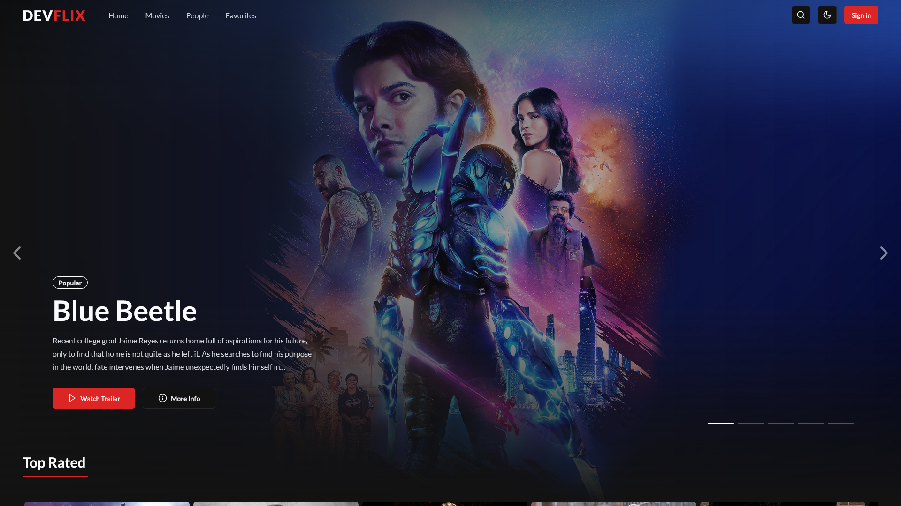

# [DevFlix 🎬](https://devflix-ochre.vercel.app/)

Devflix is a movie database website with a machine learning-powered recommendation system that provides relavant movie suggestions.

[](https://devflix-ochre.vercel.app/)

## Table of Contents

- [Tech Stack 🛠️](#tech-stack-🛠️)
- [Features 🚀](#features-🚀)
- [Running Locally 🧪](#running-locally-🧪)
  - [Prerequisites](#prerequisites)
  - [Steps](#steps)

## Tech Stack 🛠️

- **Frontend:** [Next.js](https://nextjs.org/), [TailwindCSS](https://tailwindcss.com/), [shadcn/ui](https://ui.shadcn.com/)
- **Backend:** [Django](https://www.djangoproject.com/), [Django REST framework](https://www.django-rest-framework.org/)
- **Databases:** [PostgreSQL](https://www.postgresql.org/)
- **ORM**: [Prisma](https://www.prisma.io/nextjs)
- **Auth**: [NextAuth](https://next-auth.js.org/)
- **Machine learning**: [scikit-learn](https://scikit-learn.org/stable/)
- **Deployment:** [AWS EC2](https://aws.amazon.com/ec2/), [GitHub Actions](https://github.com/features/actions), [Vercel](https://vercel.com/)

## Features 🚀

- UI Light/Dark modes
- SEO optimization with Next.js Server-side Rendering
- Movies recommendation model built with scikit-learn

## Running Locally 🧪

### Prerequisites

- [Python](https://www.python.org/)
- [Node.js](https://nodejs.org/en)
- [Docker](https://www.docker.com/) (includes Docker Compose)
- **APIs**:
  - [Google OAuth 2.0 credentials](https://developers.google.com/identity/protocols/oauth2#1.-obtain-oauth-2.0-credentials-from-the-dynamic_data.setvar.console_name-.) (Client ID and Client Secret)
  - [TMDB API](https://www.themoviedb.org/?language=en-US) (API Key)

### Steps

#### Step 1: Clone the Repository

Clone the DevFlix repository to your local machine: bash Copy code

```bash
git clone https://github.com/devltt404/devflix
cd devflix
```

#### Step 2: Setup the Server (Back-End)

1. Navigate to server folder

   ```bash
   cd server
   ```

> [!NOTE]
> Optional: It's a good practice to create a virtual environment to manage dependencies for your project:
>
> ```bash
> python -m venv venv
> source venv/bin/activate
> ```

2. Install Required Python Libraries

   ```bash
   pip install -r requirements.txt
   ```

3. Setup env variables

   Copy the `.env.example` to `.env` and update the variables.

   ```bash
   cp .env.example .env
   ```

#### Step 3: Set Up the Services with Docker Compose

We use **Docker Compose** to set up and run **PostgreSQL** locally.

1. Start services

   ```bash
   docker-compose -f docker-compose.local.yml up -d
   ```

2. Verify running Containers

   ```bash
   docker ps
   ```

   You should see the following services listed:

   - **postgres** on port `5433`

#### Step 4: Make migrations

```bash
python manage.py makemigrations
python manage.py migrate
```

#### Step 5: Setup Machine Learning Model

```bash
python manage.py build-model
```

> Note: This step might take a few minutes. Please wait until it completes.

#### Step 6: Set Up the Client (Front-End)

1. Navigate to the `client` folder:

   ```bash
   cd ../client
   ```

2. Install Dependencies

   ```bash
   npm i
   ```

3. Setup env variables

   Copy the `.env.example` to `.env`.

   ```bash
   cp .env.example .env
   ```

> [!IMPORTANT]
> You must provide values for `TMDB_API_KEY`, `GOOGLE_CLIENT_ID` and `GOOGLE_CLIENT_SECRET`

#### Step 7: Set Up the Database with Prisma

1. Run Prisma migrations to set up your database schema:

   ```bash
   npx prisma migrate dev
   ```

2. Generate Prisma Client

   ```bash
   npx prisma generate
   ```

3. Seed sample movie data to the database

   ```bash
   npm run seed
   ```

#### Last Step: Run the Website

```bash
npm run web-dev
```

Access the website through your browser at: [http://localhost:5173](http://localhost:5173)
